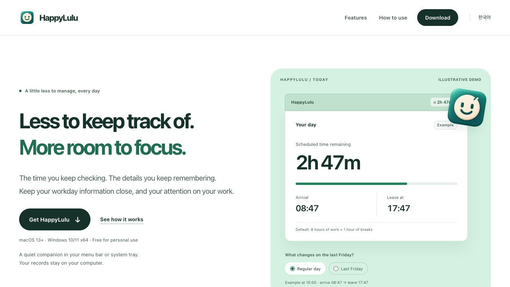

  
  <h1>HappyLulu</h1>
  
<strong>Less to keep track of. More room to focus.</strong>

  
The time you keep checking and the calendar details you need, together. A Mac menu bar and Windows tray companion that makes room for your work.

  
Tokens by <strong>lululab</strong> &nbsp;·&nbsp; Chat by <strong>Chan-Young Choi</strong>

  

    
    
    
    
  

  
<a href="#downloads">Downloads</a> · <a href="docs/USER-GUIDE.en.md">User guide</a> · <a href="https://happylulu.cy-choi-lulu.chatgpt.site/en/">Web demo</a> · <a href="README.md">한국어</a>

  

<em>An illustrative web product demo, not a capture of the actual app. See the public-version and candidate details below.</em>

## Downloads

| Platform | Direct download | Requirements · details |
| --- | --- | --- |
| **Mac 1.5.5 · build13** | [Download DMG](https://github.com/young221718/happylulu-app/releases/download/macos-v1.5.5-build13/HappyLulu-1.5.5-universal.dmg) · [ZIP](https://github.com/young221718/happylulu-app/releases/download/macos-v1.5.5-build13/HappyLulu-1.5.5-universal.zip) | macOS 13+ · Universal · [Release and checksums](https://github.com/young221718/happylulu-app/releases/tag/macos-v1.5.5-build13) |
| **Windows 1.2.1** | [Download ZIP](https://github.com/young221718/happylulu-app/releases/download/windows-v1.2.1/HappyLulu-1.2.1-windows-x64-runtime-required.zip) | Windows 10/11 x64 · .NET 10 Desktop Runtime x64 required · [Installation guide](windows/README.en.md) |

**Mac 1.5.10 · build25 is a development candidate, not a public release.** Calendar and unified settings descriptions refer to that Mac candidate. Public automatic update-feed deployment and actual installed-app validation remain incomplete. Windows has no calendar sync or built-in automatic updater.

## Quick start

1. **Give it a home.** On Mac, open the DMG and move the app to `Applications` or `~/Applications`. On Windows, install .NET 10 Desktop Runtime x64, then extract the entire ZIP to a permanent folder. Quit the old app before replacing it in the same location.
2. **Click the smiling clock.** Open the menu bar or tray panel. Enter your arrival and workday mode if you have already arrived.
3. **Make it yours.** Choose work and break hours, language and countdown format in settings.

[Detailed installation and usage](docs/USER-GUIDE.en.md#three-small-steps) · [Windows guide](windows/README.en.md)

## Keep what matters within reach

- **Time at a glance.** See arrival, expected departure and remaining time in the menu bar or tray. Choose five display formats and Korean or English.
- **Your workday, your settings.** Set work and break hours, morning or afternoon half days, and the last-Friday reduction.
- **Less record keeping.** While running, the app records the first valid screen unlock and preserves manual edits and day-off choices.
- **Calendar details together.** The Mac candidate brings half-day recognition and optional calendar setup, previews and sync into unified settings. [Supported scope (Korean)](CALENDAR.md)
- **Personal records stay local.** Attendance works without an account. Mac and Windows attendance records do not sync with each other.

HappyLulu is a personal convenience tool, not the company's official attendance, payroll or meal-payment system.

## Documentation

| Guide | What you will find |
| --- | --- |
| [User guide](docs/USER-GUIDE.en.md) | Installation, settings, workday calculations, records and known limits |
| [Windows guide](windows/README.en.md) | Runtime requirements, tray, startup and builds |
| [Calendar guide (Korean)](CALENDAR.md) | Mac candidate support, connections, previews and recovery |
| [Mac release notes](RELEASE-NOTES.md) · [Windows release notes](windows/RELEASE-NOTES.md) | Version features and public status |
| [Updates](UPDATES.md) · [Deployment](DEPLOYMENT.md) · [Validation](VALIDATION.md) | Signing, release preparation and remaining device checks (Korean) |
| [Website source](site/README.md) | Product introduction and web demo |

## Contributing

Start with an [issue](https://github.com/young221718/happylulu-app/issues). Changes follow issue → task branch → checks and independent review → PR. Read the [build and validation guide](docs/USER-GUIDE.en.md#development-and-evidence), and keep personal records, keys, credentials and generated apps out of Git.

## License

[HappyLulu Noncommercial Source-Sharing License 1.0](LICENSE): commercial use is prohibited without separate written permission. Modifying or reusing the code requires publishing the complete corresponding source of the resulting work under the same license before first use, including private use and network services. Individuals may run the unmodified official app to track their own working hours, including at work. Personal data and signing keys are never subject to source publication. This is **source-available, not OSI open source**. [Third-party notices](THIRD_PARTY_NOTICES.md) remain under their original licenses.
