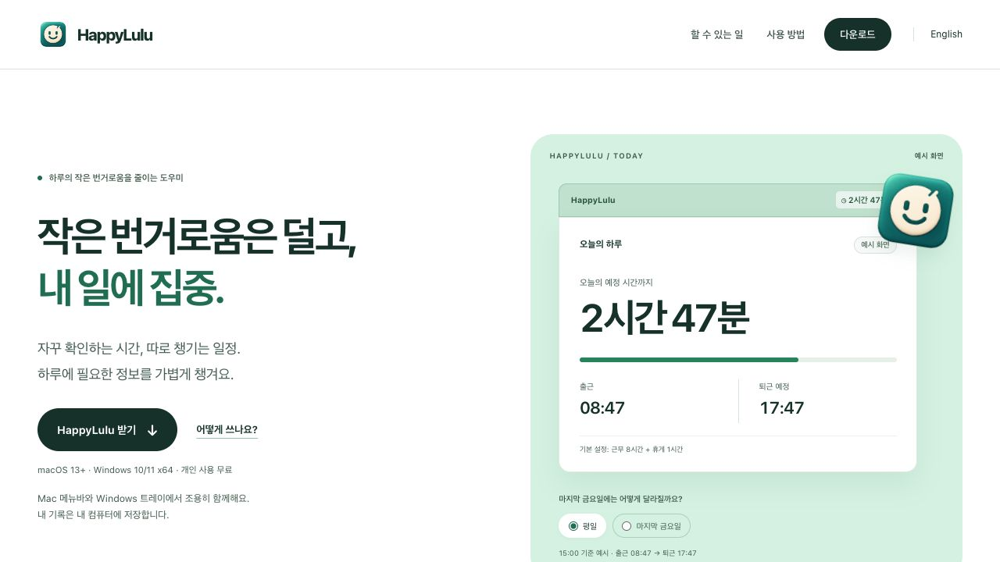

  
  <h1>HappyLulu</h1>
  
<strong>작은 번거로움은 덜고, 내 일에 집중.</strong>

  
자꾸 확인하게 되는 시간과 따로 챙겨야 하는 일정 정보를 한곳에. Mac 메뉴바 · Windows 트레이에서, 집중할 여유를 만듭니다.

  
Tokens by <strong>lululab</strong> &nbsp;·&nbsp; Chat by <strong>Chan-Young Choi</strong>

  

    
    
    
    
  

  
<a href="#다운로드">다운로드</a> · <a href="docs/USER-GUIDE.md">사용자 가이드</a> · <a href="https://happylulu.cy-choi-lulu.chatgpt.site/">웹 데모</a> · <a href="README.en.md">English</a>

  

<em>웹 제품 데모의 예시 화면이며 실제 앱 캡처가 아닙니다. 공개 버전과 개발 후보의 범위는 아래에서 확인하세요.</em>

## 다운로드

| 운영체제 | 바로 받기 | 실행 조건 · 안내 |
| --- | --- | --- |
| **Mac 1.5.5 · build13** | [DMG 다운로드](https://github.com/young221718/happylulu-app/releases/download/macos-v1.5.5-build13/HappyLulu-1.5.5-universal.dmg) · [ZIP](https://github.com/young221718/happylulu-app/releases/download/macos-v1.5.5-build13/HappyLulu-1.5.5-universal.zip) | macOS 13 이상 · Universal · [릴리즈·체크섬](https://github.com/young221718/happylulu-app/releases/tag/macos-v1.5.5-build13) |
| **Windows 1.2.1** | [ZIP 다운로드](https://github.com/young221718/happylulu-app/releases/download/windows-v1.2.1/HappyLulu-1.2.1-windows-x64-runtime-required.zip) | Windows 10/11 x64 · .NET 10 Desktop Runtime x64 필요 · [설치 안내](windows/README.md) |

**Mac 1.5.10 · build25는 개발 후보이며 공개 배포 전입니다.** 아래 캘린더·통합 설정 소개는 Mac 후보 기준입니다. 공개 자동 업데이트 피드와 실제 설치본 검증도 아직 완료하지 않았습니다. Windows에는 캘린더 동기화와 앱 자체 자동 업데이트가 없습니다.

## 빠른 시작

1. **설치하세요.** Mac은 DMG를 열어 앱을 `Applications` 또는 `~/Applications`로 옮깁니다. Windows는 .NET 10 Desktop Runtime x64를 설치한 뒤 ZIP 전체를 고정된 폴더에 풉니다. 기존 앱은 종료하고 같은 위치에서 교체하세요.
2. **웃는 시계를 누르세요.** 메뉴바·트레이에서 오늘을 확인합니다. 이미 출근했다면 출근 시각과 근무 유형을 직접 저장하세요.
3. **내 하루에 맞추세요.** 설정에서 근무·휴게시간, 언어와 시간 표시를 고릅니다.

[자세한 설치·사용 안내](docs/USER-GUIDE.md#세-단계로-시작하기) · [Windows 안내](windows/README.md)

## 필요한 정보를, 가까이에

- **시간을 한눈에.** 출근·퇴근 예정과 남은 시간을 메뉴바·트레이에서 확인합니다. 다섯 가지 표시 단위와 한국어·영어를 지원합니다.
- **내 근무 방식에 맞게.** 근무·휴게시간, 오전·오후 반차와 마지막 금요일 단축을 계산합니다.
- **기록을 챙기는 수고는 가볍게.** 앱이 켜진 동안 첫 유효 잠금 해제를 출근으로 기록하고, 직접 수정과 쉬는 날 선택을 보존합니다.
- **일정 정보도 한곳에.** Mac 개발 후보는 반차 인식과 선택형 캘린더 연결·미리보기·동기화를 통합 설정에서 관리합니다. [지원 범위](CALENDAR.md)
- **개인 기록은 내 컴퓨터에.** 출퇴근 기능은 계정 없이 사용합니다. Mac과 Windows의 기록은 서로 동기화하지 않습니다.

HappyLulu는 개인 편의 도구입니다. 회사의 공식 근태 시스템이나 급여·식대 지급 증빙을 대신하지 않습니다.

## 더 알아보기

| 안내 | 내용 |
| --- | --- |
| [사용자 가이드](docs/USER-GUIDE.md) | 설치, 설정, 근무 계산, 기록과 알려진 범위 |
| [Windows 가이드](windows/README.md) | 런타임, 트레이, 자동 실행과 빌드 |
| [캘린더 안내](CALENDAR.md) | Mac 후보의 지원 범위, 연결·미리보기와 복구 |
| [Mac 변경 기록](RELEASE-NOTES.md) · [Windows 변경 기록](windows/RELEASE-NOTES.md) | 버전별 기능과 공개 상태 |
| [업데이트](UPDATES.md) · [배포 절차](DEPLOYMENT.md) · [검증 기록](VALIDATION.md) | 서명, 배포 준비와 남은 실기기 확인 |
| [사이트 정본](site/README.md) | 제품 소개와 웹 데모 소스 |

## 기여

[이슈](https://github.com/young221718/happylulu-app/issues)에서 개선할 점을 먼저 이야기해 주세요. 변경은 이슈 → 작업 브랜치 → 검사·독립 검토 → PR 순서로 진행합니다. [빌드·검사 안내](docs/USER-GUIDE.md#개발과-검증)를 확인하고 개인 기록·키·계정정보와 생성 앱은 Git에 넣지 않습니다.

## 라이선스

[HappyLulu Noncommercial Source-Sharing License 1.0](LICENSE)을 적용합니다. **상업적 이용 금지, 코드 수정·재사용 시 결과물 전체의 재빌드 가능한 소스 공개**가 조건입니다. 비공개 실행·네트워크 서비스도 첫 사용 전에 같은 라이선스로 공개해야 하며, 공개했다고 상업적 이용이 허용되는 것은 아닙니다. 개인이 수정 없는 공식 앱으로 자기 출퇴근을 확인하는 것은 직장에서도 허용합니다. 개인 기록·키·인증정보는 공개 대상이 아닙니다. **OSI 오픈소스가 아닌 소스 공개형**이며 [외부 구성요소](THIRD_PARTY_NOTICES.md)는 각 원래 라이선스를 유지합니다.
